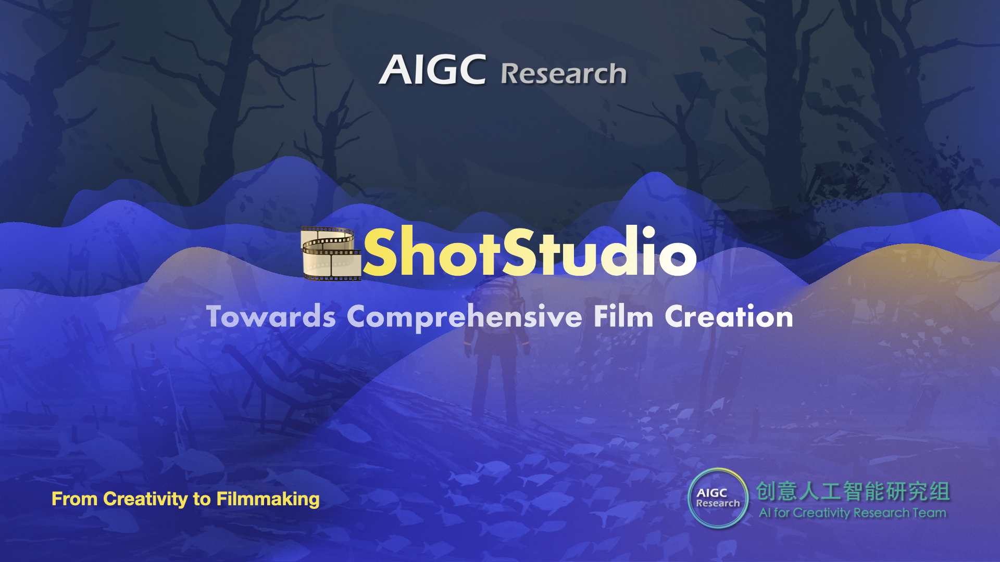

# 🎞️ `ShotStudio`: Towards Comprehensive Film Creation｜`From Creativity to Filmmaking`

  &ensp;
  &ensp;
   &ensp;

<b>ShotStudio</b> is an open-source comprehensive framework for multi-modal filmmaking, based on open-source methods, closed-source API, and our self-developed works.

<b>ShotStudio</b> supports story and script writing, character/scene/action design, storyboard creation, video clip generation, VFX, and audio design (bgm, dubbing and sound).

## 🚩 Launch Planning & Latest Updates
- [ ] **[2026]** 🚀 **ShotStudio-v1** code release.
- [ ] **[2025.10～2026]** 🚀 Ongoing self-developed stage.
- [x] **[2025.10]** 🚀 Initial project launch.
